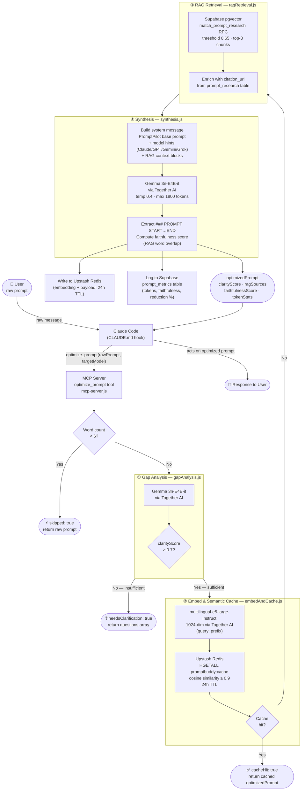

# PromptPilot — Architecture

## System Overview

PromptPilot runs as an **MCP (Model Context Protocol) stdio server** that intercepts every user prompt before Claude responds. It is wired into Claude Code via `CLAUDE.md` — Claude is instructed to call `optimize_prompt` before acting on any user message.

---

## Full Pipeline Diagram



---

## Component Responsibilities

| File | Stage | External Service |
|---|---|---|
| `mcp-server.js` | Entry point, routing, fallback | — |
| `pipeline/gapAnalysis.js` | ① Clarity scoring, question generation | Together AI (Gemma 3n) |
| `pipeline/embedAndCache.js` | ② Embedding + semantic cache read/write | Together AI (e5-large), Upstash Redis |
| `pipeline/ragRetrieval.js` | ③ Vector similarity search + citation lookup | Supabase (pgvector) |
| `pipeline/synthesis.js` | ④ Prompt optimization, faithfulness scoring, metrics | Together AI (Gemma 3n), Supabase |

---

## Data Flow Summary

```
User prompt
  → [word count < 6?] → skip (return raw)
  → Gap Analysis (Gemma 3n) → [clarity < 0.7?] → return clarification questions
  → Embed (e5-large-instruct, 1024-dim)
  → Semantic Cache (Upstash Redis, cosine ≥ 0.9) → [hit?] → return cached result
  → RAG Retrieval (Supabase pgvector, top-3 chunks @ 0.65)
  → Synthesis (Gemma 3n + RAG context + model hints)
  → Write cache (24h TTL) + log metrics
  → Return optimizedPrompt to Claude
```

---

## Fallback Guarantee

If **any** stage throws an error, `mcp-server.js` catches it and returns:

```json
{ "optimizedPrompt": "<original raw prompt>", "fallback": true }
```

Claude always receives a usable response — the pipeline failure is never surfaced to the user.

---

## External Services

| Service | Purpose | Config Key |
|---|---|---|
| Together AI | Gemma 3n inference (gap analysis + synthesis), e5 embeddings | `TOGETHER_API_KEY` |
| Supabase | pgvector RAG knowledge vault + prompt metrics logging | `SUPABASE_URL`, `SUPABASE_SERVICE_ROLE_KEY` |
| Upstash Redis | Semantic cache (cosine similarity, 24h TTL) | `UPSTASH_REDIS_REST_URL`, `UPSTASH_REDIS_REST_TOKEN` |
